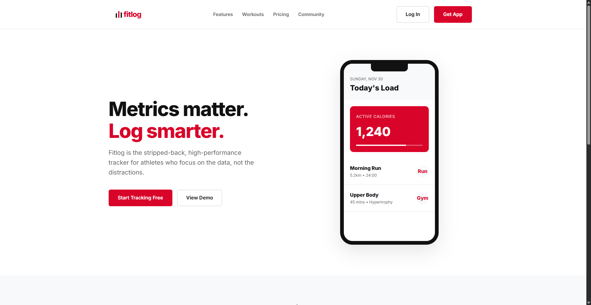

<div align="center">
<a href="https://github.com/fahmirizalbudi/fitlog" target="blank">

</a>
<br/>

<br />
<br />


</div>

<br />

## 🌐 Fitlog

Fitlog Modern Fitness Tracking landing page based on web application. Built on HTML, CSS using Vite build tools. Key features include:

## 🖼️ Preview



## ✨ Features

- **🏗️ Semantic Markup:** Accessible and SEO-friendly HTML5 structure.
- **🎨 Modern UI/UX:** Clean and aesthetic design implemented.

## 👩‍💻 Tech Stack

- **HTML5**: The standard markup language for documents designed to be displayed in a web browser.
- **CSS3**: Style sheet language used for describing the presentation of a document written in HTML.

## 📦 Getting Started

To get a local copy of this project up and running, follow these steps.

### 🚀 Prerequisites

- **Chrome** (or another supported HTML viewer).

## 🛠️ Installation

1. **Clone the repository:**

   ```bash
   git clone https://github.com/fahmirizalbudi/fitlog.git
   cd fitlog
   ```

2. **Open HTML file:**

   ```bash
   > Open index.html file using web browser
   ```

## 📖 Usage

### ✔ Running the Application

> Open [fitlog/index.html](fitlog/index.html) to view it in the browser.

## 📜 License

All rights reserved. This project is for educational purposes only and cannot be used or distributed without permission.
